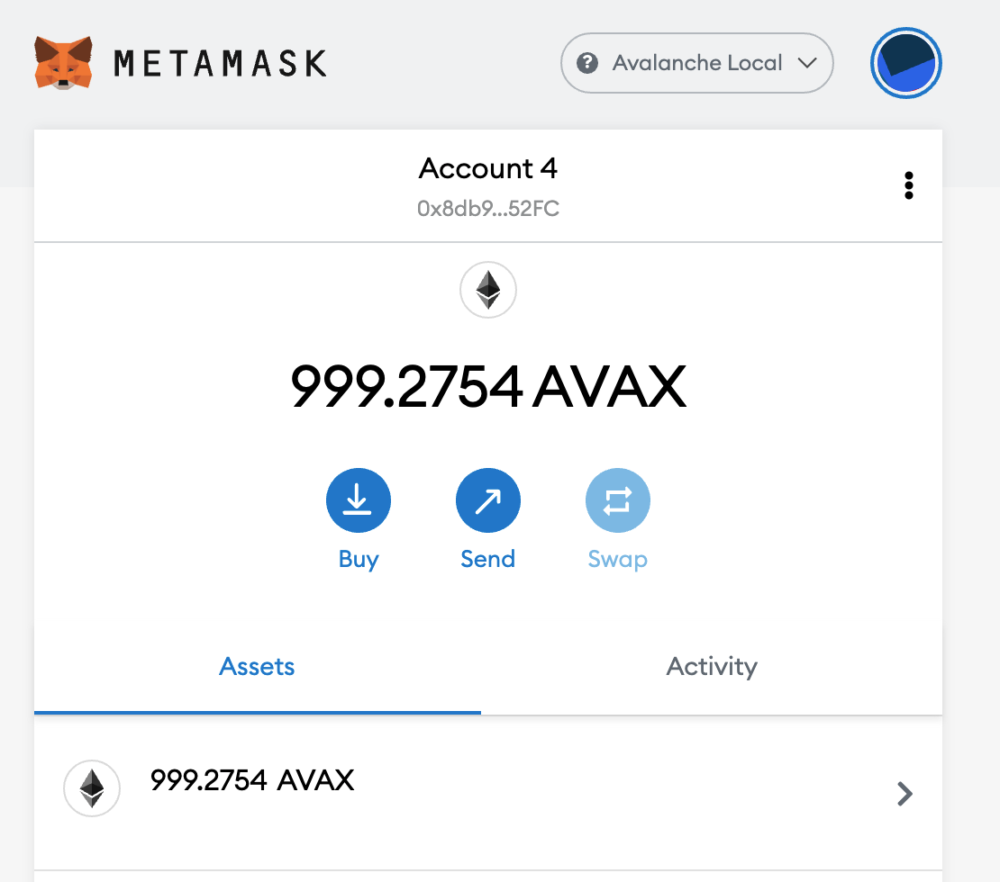
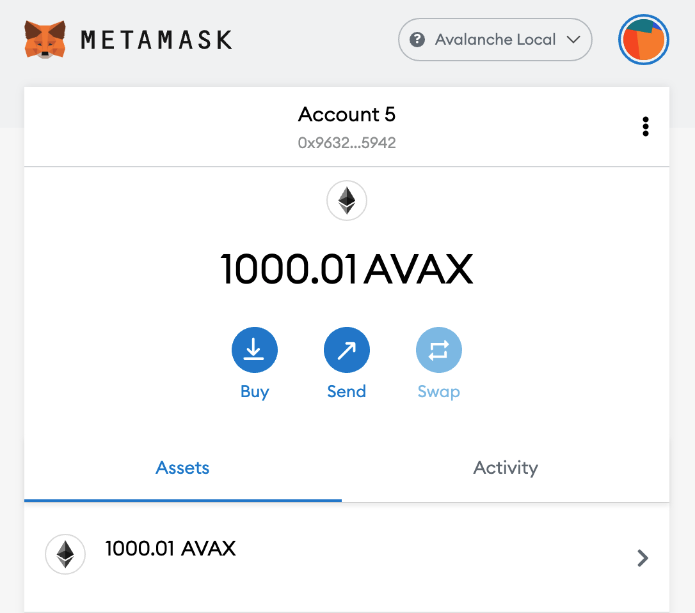
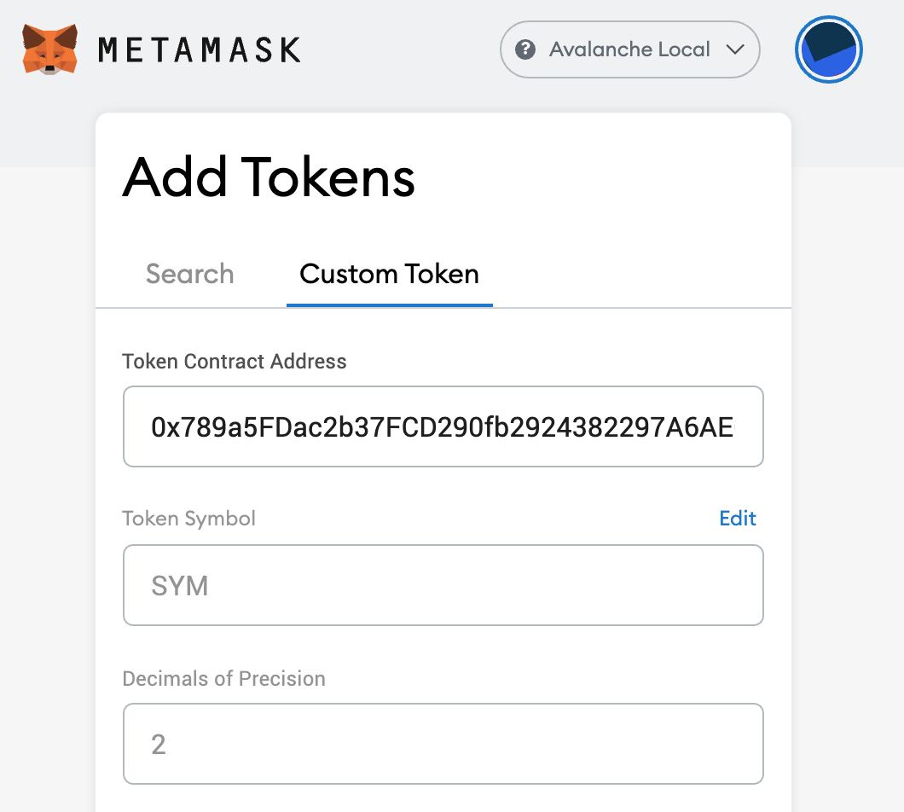
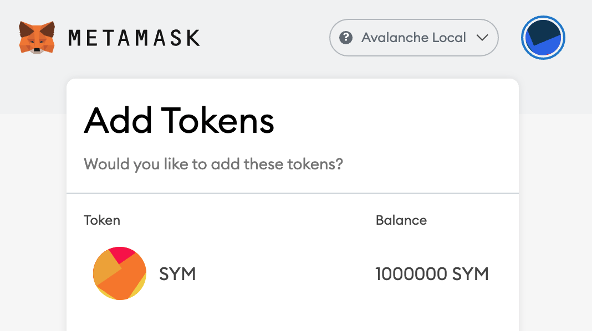
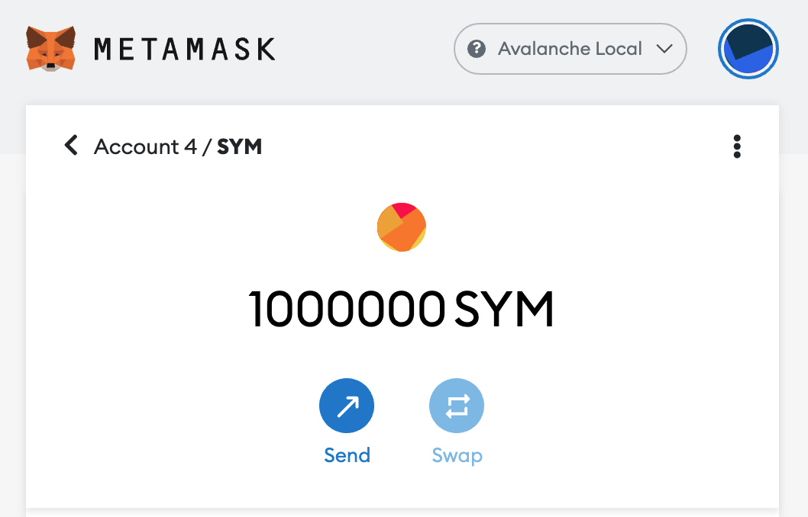
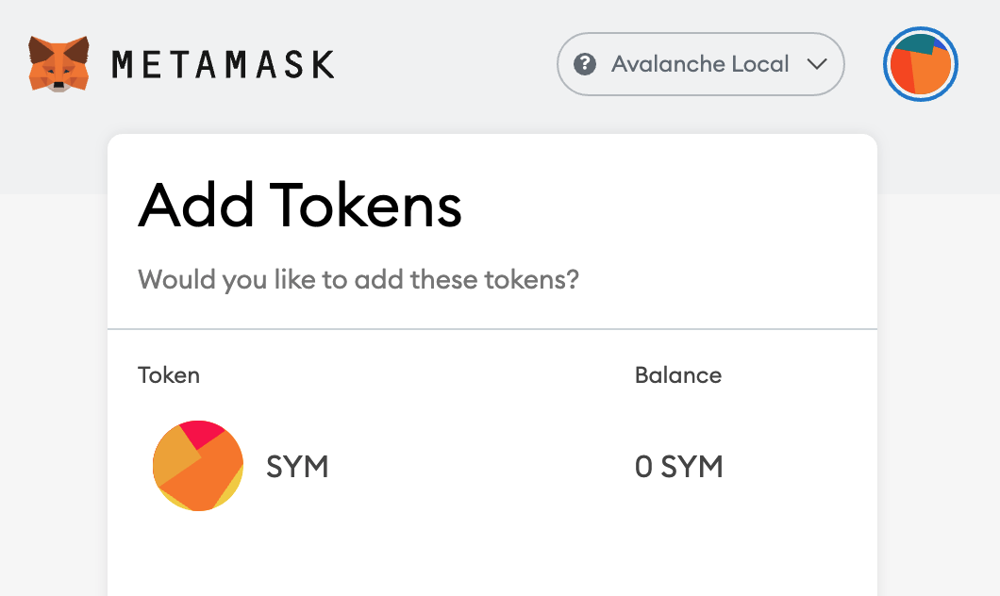
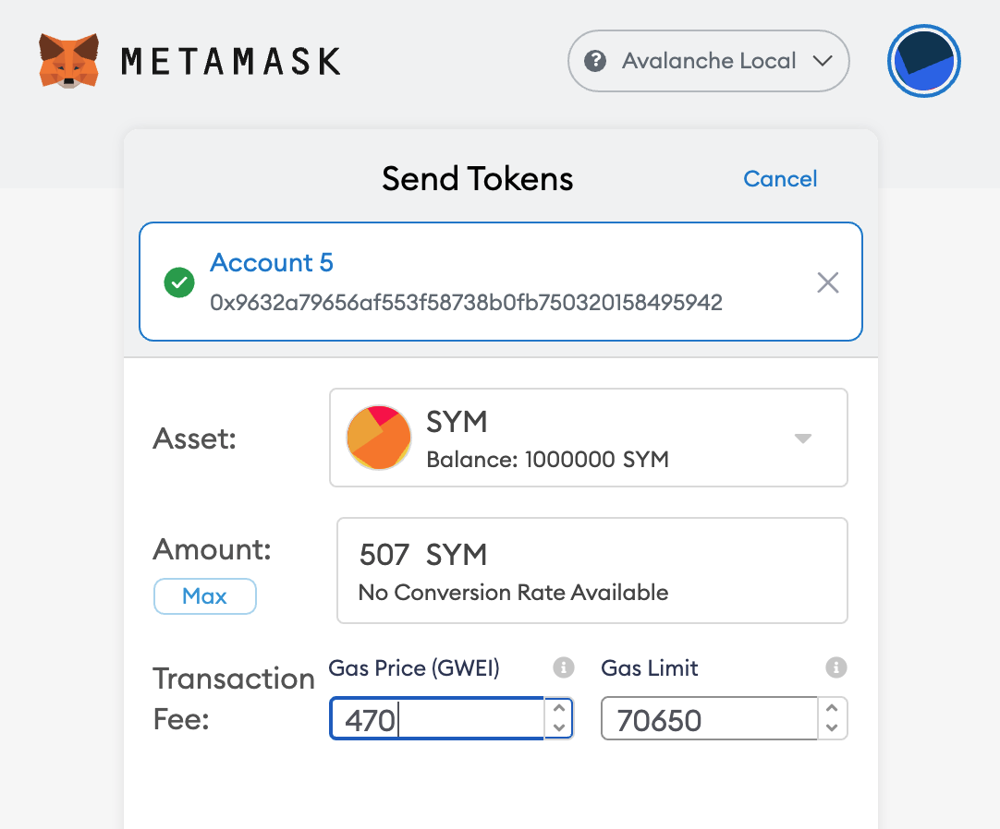
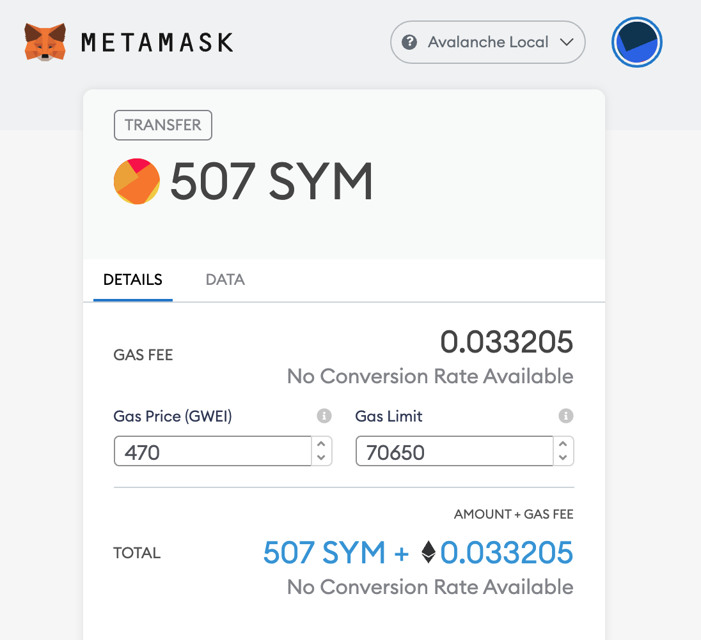
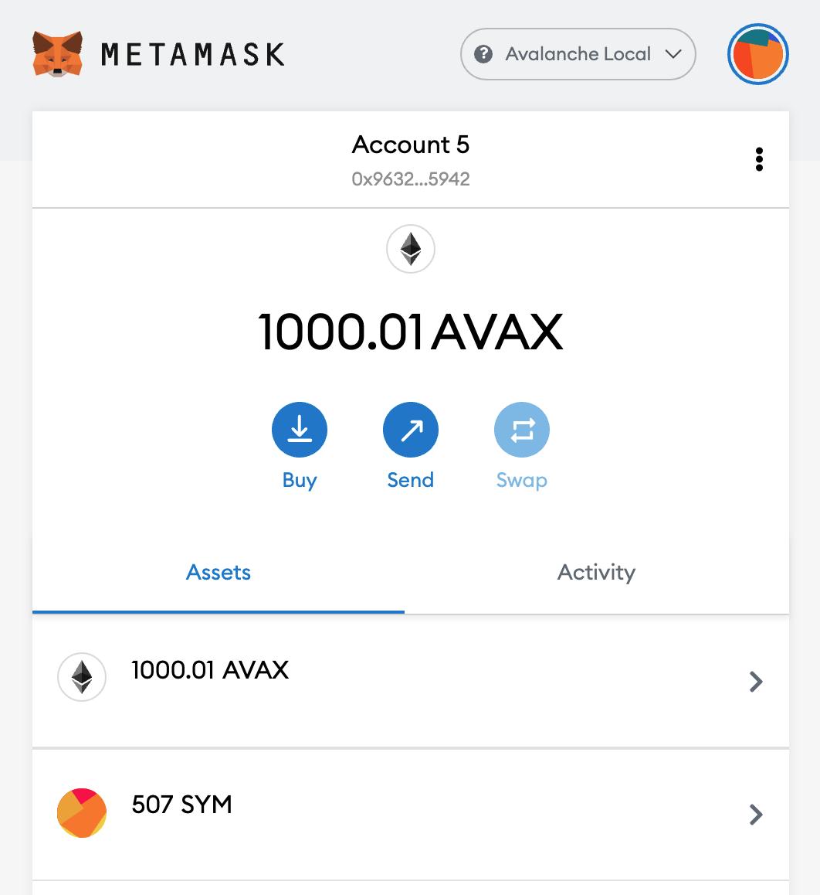

# Writing Smart Contracts on Avalanche

## Introduction

Avalanche is an open-source platform for launching decentralized applications and enterprise blockchain deployments in one interoperable, highly scalable ecosystem. Avalanche gives you complete control on both the network and application layers&mdash;helping you build anything you can imagine.

Avalanche can do anything a typical Ethereum client can by using the Ethereum-standard RPC calls. The immediate benefits of using Avalanche rather than Ethereum are speed, scale and throughput. Avalanche offers thousands of transactions per second with sub-second finality at inexpensive fees. These properties will considerably improve the performance of DApps and the user experience of smart-contracts.

The goal of this guide is to lay out a best-practices regarding writing, testing and deploying smart-contracts to Avalanche. We'll be building smart contracts with [Hardhat](https://hardhat.org) which is an Avalanche development environment for professionals.

## Prerequisites

### NodeJS and Yarn

First install the LTS of [nodejs](https://nodejs.org/en) which is `14.15.4` at the time of writing. NodeJS bundles `npm`.

Next install [yarn](https://yarnpkg.com):

```zsh
npm install -g yarn
```

### AvalancheGo and Avash

[AvalancheGo](https://github.com/ava-labs/avalanchego) is our full node written in Golang. [Avash](https://docs.avax.network/build/tools/avash) is our local test network. Together, you can deploy private local networks and run tests on them.

### Solidity and Avalanche

It is also helpful to have a basic understanding of [Solidity](https://docs.soliditylang.org) and [Avalanche](https://docs.avax.network).

## Dependencies

First clone this repo and download the necessary packages.

```zsh
git clone https://github.com/ava-labs/avalanche-smart-contract-quickstart.git
cd avalanche-smart-contract-quickstart
yarn
```

## Write Contracts

Edit the `Coin.sol` contract in `contracts/`. `Coin.sol` is an [Open Zeppelin](https://openzeppelin.com) [ERC20](https://eips.ethereum.org/EIPS/eip-20) contract. ERC20 is a popular smart contract interface for interoperability. You can also add your own contracts.

## Building

In [`package.json`](./package.json) there's a `compile` script.

```json
"compile": "npx hardhat compile",
```

Run `yarn compile` to make sure your project compiles.

## Prepare to Deploy

Edit the deployment script in `scripts/deploy.js`

## Deploy

Hardhat enables deploying to multiple environments. In [`package.json`](./package.json) there is a script for deploying.

```json
"deploy": "npx hardhat run scripts/deploy.js",
```

You can chose which environment that you want to deploy to by passing in the `--network` flag with `avash`, `fuji`, or `mainnet` for each respective environment. If you don't pass in `--network` then it will default to the hardhat network.  For example, if you want to deploy to mainnet

```zsh
yarn deploy --network mainnet
```

When you deploy to `avash`, `fuji` or `mainnet` you can add your private key(s) as an array to the respective environment's `accounts` field in [hardhat.config.js](./hardhat.config.js).

## Hardhat Tasks

You can define custom hardhat tasks in [hardhat.config.js](./hardhat.config.js). There are two tasks included as examples&mdash;`accounts` and `balances` both of which have scripts in [package.json](./package.json).

```json
"accounts": "npx hardhat accounts",
"balances": "npx hardhat balances"
```

`yarn accounts` will print the list of accounts. `yarn balances` prints the list of AVAX account balances. As with other `yarn` scripts you can pass in a `--network` flag to hardhat tasks.

### Accounts

Print a list of accounts on the `avash` network.

```zsh
yarn accounts --network avash
yarn run v1.22.4
$ npx hardhat accounts --network avash
0x8db97C7cEcE249c2b98bDC0226Cc4C2A57BF52FC
0x9632a79656af553F58738B0FB750320158495942
0x55ee05dF718f1a5C1441e76190EB1a19eE2C9430
0x4Cf2eD3665F6bFA95cE6A11CFDb7A2EF5FC1C7E4
0x0B891dB1901D4875056896f28B6665083935C7A8
0x01F253bE2EBF0bd64649FA468bF7b95ca933BDe2
0x78A23300E04FB5d5D2820E23cc679738982e1fd5
0x3C7daE394BBf8e9EE1359ad14C1C47003bD06293
0x61e0B3CD93F36847Abbd5d40d6F00a8eC6f3cfFB
0x0Fa8EA536Be85F32724D57A37758761B86416123
```

### Balances

Print a list of accounts and their corresponding AVAX balances on the `avash` network.

```zsh
yarn balances --network avash
yarn run v1.22.4
$ npx hardhat balances --network avash
0x8db97C7cEcE249c2b98bDC0226Cc4C2A57BF52FC has balance 0
0x9632a79656af553F58738B0FB750320158495942 has balance 0
0x55ee05dF718f1a5C1441e76190EB1a19eE2C9430 has balance 0
0x4Cf2eD3665F6bFA95cE6A11CFDb7A2EF5FC1C7E4 has balance 0
0x0B891dB1901D4875056896f28B6665083935C7A8 has balance 0
0x01F253bE2EBF0bd64649FA468bF7b95ca933BDe2 has balance 0
0x78A23300E04FB5d5D2820E23cc679738982e1fd5 has balance 0
0x3C7daE394BBf8e9EE1359ad14C1C47003bD06293 has balance 0
0x61e0B3CD93F36847Abbd5d40d6F00a8eC6f3cfFB has balance 0
0x0Fa8EA536Be85F32724D57A37758761B86416123 has balance 0
```

## Sending AVAX

[package.json](./package.json) has a `send-avax` script which is found in [scripts/sendAvax.js](./scripts/sendAvax.js).

```json
"send-avax": "npx hardhat run scripts/sendAvax.js",
```

Run it with `yarn send-avax`.

## Funding Accounts

[package.json](./package.json) has a `fund-cchain-addresses` script. [fund-cchain-addresses](./scripts/fund-cchain-addresses.js) will fund each of the C-Chain `accounts` on the `avash` network with 1000 AVAX.

```json
"scripts": {
  ...
  "fund-cchain-addresses": "npx hardhat run scripts/fund-cchain-addresses.js"
}
```

This is a utility script which handles funding accounts on the C-Chain since it's a prerequisite for running smart contracts. It's currently hardcoded to use the `12345` or `avash` network.

```zsh
yarn fund-cchain-addresses
yarn run v1.22.4
$ npx hardhat run scripts/fund-cchain-addresses.js
Exporting 1000 AVAX to each address on the C-Chain...
2b75ae74ScLkWe5GVFTYJoP2EniMywkcZySQUoFGN2EJLiPDgp
Importing AVAX to the C-Chain...
2dyXcQGiCk1ckCX4Fs8nLgL8GJgsM72f9Ga13rX5v9TAguVJYM
✨  Done in 4.07s.
```

You can confirm that it worked by running `yarn balance --network avash`.

```zsh
yarn balances --network avash
yarn run v1.22.4
$ npx hardhat balances --network avash
0x8db97C7cEcE249c2b98bDC0226Cc4C2A57BF52FC has balance 1000000000000000000000
0x9632a79656af553F58738B0FB750320158495942 has balance 1000000000000000000000
0x55ee05dF718f1a5C1441e76190EB1a19eE2C9430 has balance 1000000000000000000000
0x4Cf2eD3665F6bFA95cE6A11CFDb7A2EF5FC1C7E4 has balance 1000000000000000000000
0x0B891dB1901D4875056896f28B6665083935C7A8 has balance 1000000000000000000000
0x01F253bE2EBF0bd64649FA468bF7b95ca933BDe2 has balance 1000000000000000000000
0x78A23300E04FB5d5D2820E23cc679738982e1fd5 has balance 1000000000000000000000
0x3C7daE394BBf8e9EE1359ad14C1C47003bD06293 has balance 1000000000000000000000
0x61e0B3CD93F36847Abbd5d40d6F00a8eC6f3cfFB has balance 1000000000000000000000
0x0Fa8EA536Be85F32724D57A37758761B86416123 has balance 1000000000000000000000
✨  Done in 0.62s.
```

## Hardhat Help

You can run `yarn hardhat` to list hardhat version, usage instructions, global options and available tasks.

## Typical avash workflow

First confirm you have the latest and greatest AvalancheGo built.

```zsh
cd /path/to/avalanchego
git fetch -p
git checkout master
./scripts/build.sh
```

Next fire up avash and run a script to configure your network.

```zsh
cd /path/to/avash
git fetch -p
git checkout master
go build
 ./avash
Config file set: /Users/username/.avash.yaml
Avash successfully configured.
avash> runscript scripts/five_node_staking.lua
RunScript: Running scripts/five_node_staking.lua
RunScript: Successfully ran scripts/five_node_staking.lua
```

Now you have a local avalanche network with 5 staking nodes. Next transfer 1000 AVAX from the X-Chain to each of the 10 avash accounts in `hardhat.config.js`.

```zsh
cd /path/to/avalanche-smart-contract-quickstart
yarn fund-cchain-addresses
yarn run v1.22.4
$ npx hardhat run scripts/fund-cchain-addresses.js --network avash
Exporting 1000 AVAX to each address on the C-Chain...
2b75ae74ScLkWe5GVFTYJoP2EniMywkcZySQUoFGN2EJLiPDgp
Importing AVAX to the C-Chain...
2dyXcQGiCk1ckCX4Fs8nLgL8GJgsM72f9Ga13rX5v9TAguVJYM
✨  Done in 5.03s.
```

Confirm each of the accounts are funded with 1000 AVAX.

```zsh
yarn balances --network avash
yarn run v1.22.4
$ npx hardhat balances --network avash
0x8db97C7cEcE249c2b98bDC0226Cc4C2A57BF52FC has balance 1000000000000000000000
0x9632a79656af553F58738B0FB750320158495942 has balance 1000000000000000000000
0x55ee05dF718f1a5C1441e76190EB1a19eE2C9430 has balance 1000000000000000000000
0x4Cf2eD3665F6bFA95cE6A11CFDb7A2EF5FC1C7E4 has balance 1000000000000000000000
0x0B891dB1901D4875056896f28B6665083935C7A8 has balance 1000000000000000000000
0x01F253bE2EBF0bd64649FA468bF7b95ca933BDe2 has balance 1000000000000000000000
0x78A23300E04FB5d5D2820E23cc679738982e1fd5 has balance 1000000000000000000000
0x3C7daE394BBf8e9EE1359ad14C1C47003bD06293 has balance 1000000000000000000000
0x61e0B3CD93F36847Abbd5d40d6F00a8eC6f3cfFB has balance 1000000000000000000000
0x0Fa8EA536Be85F32724D57A37758761B86416123 has balance 1000000000000000000000
✨  Done in 0.72s.
```

Send each of the accounts some AVAX from the first account.

```zsh
yarn send-avax --network avash
yarn run v1.22.4
$ npx hardhat run scripts/sendAvax.js --network avash
Seeding addresses with AVAX
✨  Done in 1.33s.
```

Confirm that the balances are updated

```zsh
yarn balances --network avash
yarn run v1.22.4
$ npx hardhat balances --network avash
0x8db97C7cEcE249c2b98bDC0226Cc4C2A57BF52FC has balance 999821170000000000000
0x9632a79656af553F58738B0FB750320158495942 has balance 1000010000000000000000
0x55ee05dF718f1a5C1441e76190EB1a19eE2C9430 has balance 1000010000000000000000
0x4Cf2eD3665F6bFA95cE6A11CFDb7A2EF5FC1C7E4 has balance 1000010000000000000000
0x0B891dB1901D4875056896f28B6665083935C7A8 has balance 1000010000000000000000
0x01F253bE2EBF0bd64649FA468bF7b95ca933BDe2 has balance 1000010000000000000000
0x78A23300E04FB5d5D2820E23cc679738982e1fd5 has balance 1000010000000000000000
0x3C7daE394BBf8e9EE1359ad14C1C47003bD06293 has balance 1000010000000000000000
0x61e0B3CD93F36847Abbd5d40d6F00a8eC6f3cfFB has balance 1000010000000000000000
0x0Fa8EA536Be85F32724D57A37758761B86416123 has balance 1000010000000000000000
```

Compile the smart contract.

```zsh
yarn compile
yarn run v1.22.4
$ rimraf ./build/
$ npx hardhat compile
Compiling 1 file with 0.6.4
Compilation finished successfully
✨  Done in 2.13s.
```

Deploy the contract to the `avash` local network

```zsh
yarn deploy --network avash
yarn run v1.22.4
$ npx hardhat run scripts/deploy.js --network avash
Coin deployed to: 0x789a5FDac2b37FCD290fb2924382297A6AE65860
✨  Done in 1.28s.
```

We now have a token deployed at `0x789a5FDac2b37FCD290fb2924382297A6AE65860`. The `constructor` function of [this token](contracts/Coin.sol#L15) `mint`s the `TOTAL_BALANCE` to the account which called the contract which is the first address in the `avash` `accounts` array in [hardhat.config.js](./hardhat.config.js).

```json
  "0x56289e99c94b6912bfc12adc093c9b51124f0dc54ac7a766b2bc5ccf558d8027", 
  "0x7b4198529994b0dc604278c99d153cfd069d594753d471171a1d102a10438e07",
```

Import them both into MetaMask.

<div></div>

<div></div>
  
Now we add the `SYM` token to each account in MetaMask. Add Token -> Custom Token and paste in the `Token Contract Address`. The `Token Symbol` and `Decimals of Precision` should populate.

<div></div>

<div></div>

<div></div>

**NOTE** the 2nd account doesn't have any `SYM` because it was all `mint`ed to the 1st account in the Coin's `constructor` function.

<div></div>

You can now send `SYM` from the 1st account to the 2nd account. Go to the 1st account in MetaMask and click `Send SYM`, `Transfer between my accounts`, next select the 2nd account.

Next you'll land on the `Send Tokens` screen. Here you can set the amount to `507` and the Gas Price to `470`. This gas price is very important. If you set the value below `470` then the transaction won't go through so make sure and double confirm this is correct.

After clicking `Next` you'll land on the final confirmation screen. Make sure that everything looks good and click `Confirm`.

<div></div>

<div></div>

Lastly note that the 2nd account has 507 `SYM`.

<div></div>
